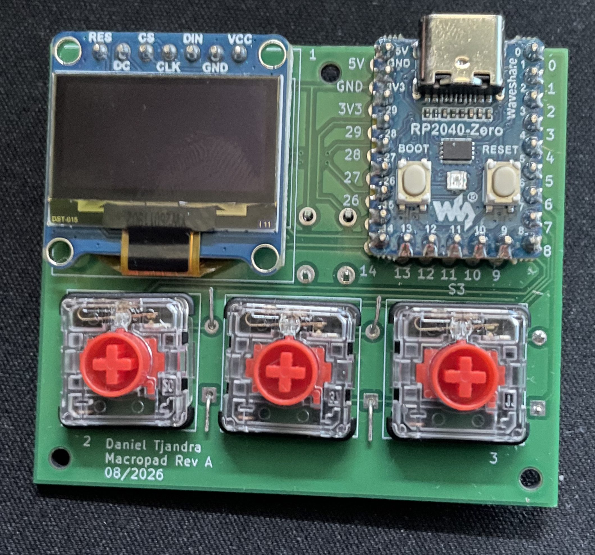
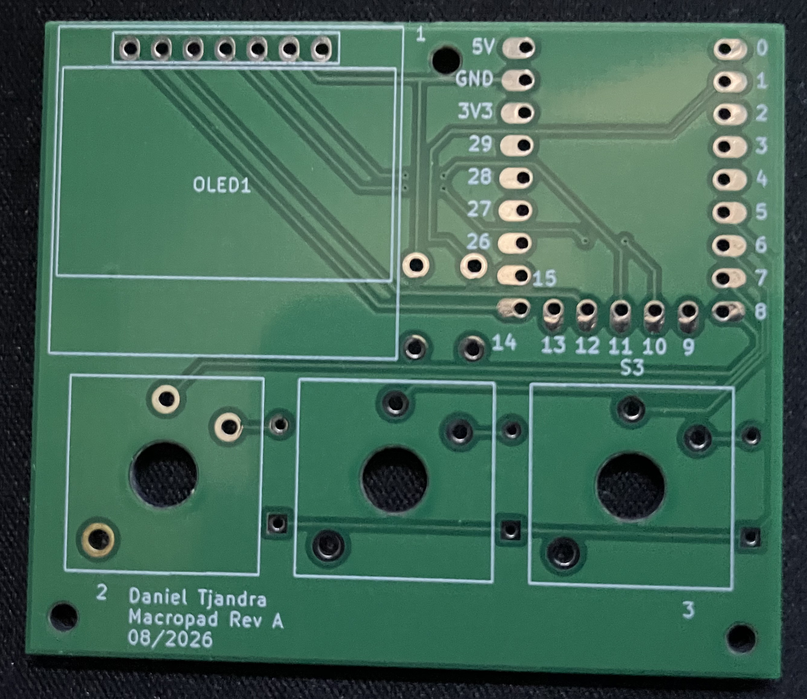
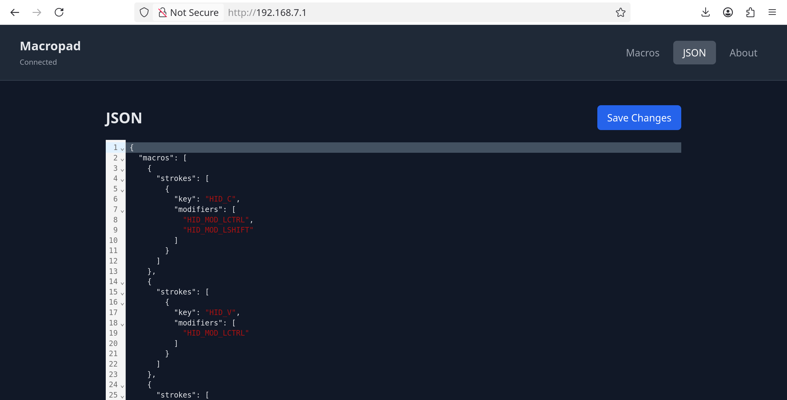

# RP2040 Macropad

A custom programmable macropad built around the **RP2040-Zero**.

The project combines custom hardware, embedded firmware, and a web-based configuration interface into a standalone programmable keyboard. Macros are stored directly on the device and can be configured through a web interface without recompiling the firmware.

<!-- Information about building this yourself can be found here. (TBC)-->



---

# Hardware

The macropad uses an **RP2040-Zero** as its main controller, along with a custom-designed PCB and enclosure.

The hardware includes:

* RP2040 microcontroller
* Mechanical keyboard switches
* 1N4148 diodes
* 128×64 OLED display
* Push button

The PCB was designed specifically for this project in **KiCad**. You can view these files [here](https://github.com/dtjandra888/Hardware/tree/main/macro).



---

# Firmware

The firmware is written in C using the **Raspberry Pi Pico SDK**. It controls both the key matrix scanning as well as the configuration through the web UI.

The macropad appears to the host computer as a normal USB keyboard, so no custom host software is required.

Configuration is stored in the device's flash memory, allowing macros to persist across power cycles.

---

# Web Configuration

One of the main features of the project is the ability to configure the macropad directly from a web browser.

When the plugging in the device, hold down the push button to start configuration mode. This creates a USB network connection and runs a lightweight web server on the RP2040.

The web application is built with **Svelte and TypeScript** and is compiled directly into the firmware. This means the configuration interface is hosted by the macropad itself rather than requiring a separate server.



The interface provides both a graphical macro overview (currently TBC) and a JSON editor for more direct configuration.

---

# Configuration

The macropad uses a JSON representation for its configuration.

A simplified configuration looks like:

```json
{
  "macros": [
    {
      "strokes": [
        {
          "key": "HID_C",
          "modifiers": ["HID_MOD_LCTRL"]
        }
      ]
    }
  ]
}
```

The configuration can be read and updated through the device's HTTP API.

Both the web application and firmware validate configuration data before it is accepted. This keeps malformed configuration from being written to persistent storage.

---

# Software Architecture

The project brings together several layers:

```text
┌────────────────────────────────────────────┐
│              Web Interface                 │
│           Svelte + TypeScript              │
└──────────────────────┬─────────────────────┘
                       │
                       │ JSON / HTTP
┌────────────────────────────────────────────┐
│              Embedded Web API              │
│                  lwIP                      │
└──────────────────────┬─────────────────────┘
                       │ Flash memory
┌────────────────────────────────────────────┐
│                Firmware                    │
│                                            │
│   Configuration │ Macros │ USB HID         │
└──────────────────────┬─────────────────────┘
                       │
┌────────────────────────────────────────────┐
│                 Hardware                   │
│                                            │
│       RP2040 │ Keys │ OLED │ RGB LED       │
└────────────────────────────────────────────┘
```

This architecture allows the same configuration to flow from the web interface all the way down to the embedded macro engine.
